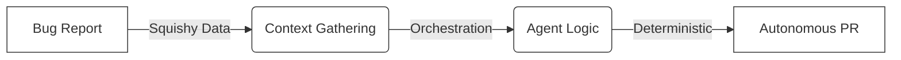

<!--there are a bunch of things that people like to say that AI is in the context of coding and tech more generally. Some people call any AI app a ChatGPT wrapper. This is about equivalent to calling any SaaS app a SQL wrapper. while true that it is the core tech driving the app forward, it certainly isnt just a wrapper. If you want to think about how to use the internet today vs how people thought the internet was going to be used (or pick your technology,) when it first came out, we were always just wrong in the majority of the cases. So the point of this presentation is to challenge our equivocations and ask what AI can actually be used for in the future. I would like to make a connection between LLMs and SQL like i mentioned. I would like to make the comparison between how people use it in coding with the autocomplete and the slot machine. I want to talk about the act of squishy data or amorphous functions that can take in arbitrary data structures and how it can have output based on unclean data. I want to talk about how with data, cleaning it is the hardest part of using the data. I want to talk about the concept of data retrieval vs data augmentation with LLMs. -->

<!--https://www.adriantull.com/blog/bug-report-->

# Automating the Bug-to-PR Pipeline

An Elegant Weapon for a More Civilized Age of Development

<!--
CONTEXT:
This presentation is about shifting the perspective on AI.
Instead of seeing it as a "magic box" or a "peon" to do our typing, 
we should see it as a "cog" in a larger, orchestrated machine.
The "Bug-to-PR" pipeline is the concrete example of this philosophy in action.
-->

---
layout: center
---

# Is it "Just a ChatGPT Wrapper"?

<v-clicks>

### The Equivocation
"Any AI app is just a ChatGPT wrapper."

### The Reality
Is a SaaS app just a "SQL Wrapper"?

### The Challenge
We are usually wrong about how technology will be used when it first arrives.

</v-clicks>

<!--
NOTES:
- Start by challenging the common dismissive take that AI apps are just wrappers.
- Use the SQL analogy: SQL is the core tech of SaaS, but we don't call Salesforce a "SQL wrapper."
- The goal is to ask: What can AI *actually* be in the future if we stop looking at it through the lens of a chat box?
-->

---
layout: center
---

# LLMs as the "SQL of Reasoning"

### Data Retrieval (SQL)
- Structured
- Rigid Schema
- Deterministic
- "Clean" data is required

<v-click>

### Data Augmentation (LLM)
- Amorphous / "Squishy"
- Arbitrary Structures
- Probabilistic
- Handles "Unclean" data

</v-click>

<!--
NOTES:
- This slide hits the "Top Priority" paragraph from thoughts.md.
- Highlight that cleaning data is usually the hardest part of tech.
- LLMs allow us to build "Amorphous Functions" that can take in squishy, unclean data and produce structured outcomes.
- Transition from simple data retrieval to intelligent data augmentation.
-->

---
layout: center
---

# Cogs, Not Peons
## Moving beyond the "Slot Machine"

<v-clicks>

- **The Autocomplete Trap:** Thinking AI is just for finishing your sentences.
- **The Peon Model:** Asking AI to "write a feature" (unreliable).
- **The Cog Model:** Processing specific data within a specific workflow (reliable).

</v-clicks>

<!--
NOTES:
- Contrast "Vibe-coding" (randomly generating thousands of lines) with "Orchestration."
- A "Peon" requires constant supervision; a "Cog" is a reliable part of a machine.
- We want to build systems designed to yield consistently accurate outcomes.
-->

---
layout: center
---

# Case Study: The Bug-to-PR Pipeline
## An Elegant Weapon

<!--
NOTES:
- This is the "Elegant Weapon" reference. 
- It's not clumsy or random (like a blaster/vibe-coding).
- It's a civilized, automated workflow that bridges the gap between user intent and code fix.
-->

---
layout: center
---

# Step 1: The Info-Rich Report
## Capturing User Intent

<v-clicks>

- **Beyond Logs:** Logs catch crashes, not "bugs in design."
- **Squishy Inputs:** User context + Screenshots + System Logs.
- **The "Validation" Gap:** Did we actually solve the user's issue?

</v-clicks>

<!--
NOTES:
- Mention that screenshots provide as much info as vibe-coders use, but we're going "beyond."
- The hardest part of a bug is often understanding what the user *meant* to happen.
- This is where the "squishy data" enters the pipeline.
-->

---
layout: center
---

# Step 2: Context & Jira
## The Agent Picks Up the Slack

<v-clicks>

- **Automatic Triage:** Parsing intent into technical requirements.
- **Deep Context:** Searching related functions, types, and logic—not just the error line.
- **Validation vs. Verification:** 
  - *Verification:* Did the code run? (Sentry catches this).
  - *Validation:* Was the business logic right? (Only user feedback catches this).

</v-clicks>

<!--
NOTES:
- Explain why Sentry isn't enough: it catches crashes, but it can't tell if a business logic assumption was wrong.
- The agent "bridges the gap" by feeding user experience data directly into the technical context.
-->

---
layout: center
---

# Step 3: The Autonomous PR
## The Machine Closes the Loop

<v-clicks>

1. **Branch Creation**
2. **Issue Resolution** (using gathered context)
3. **Automated Push**
4. **PR Readiness** (waiting for your review)

</v-clicks>

<!--
NOTES:
- By the time you've responded to the user's email, the PR is already waiting.
- You aren't "doing the typing"—you are the architect reviewing the machine's output.
-->

---
layout: center
class: text-center
---

# The Civilized Path

Stop asking LLMs to **"write a feature."**
Start asking them to **"process this data within this workflow."**

[adriantull.com](https://www.adriantull.com/blog/bug-report)

<!--
NOTES:
- Final summary of the "Cog" philosophy.
- Call to action: Challenge your equivocations.
- AI as an architectural idea, not just a tool.
-->

---
layout: end
---

